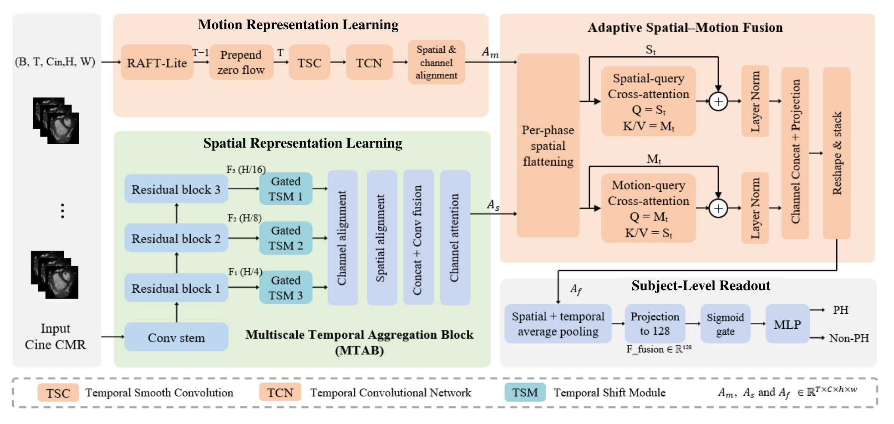

# SM-PH Net: Joint Spatial-Motion Representation Learning for Pulmonary Hypertension Detection from Cine Cardiac Magnetic Resonance


## Overview

SM-PH Net is a lightweight dual-branch framework for subject-level pulmonary hypertension (PH) detection from single-plane cine cardiac magnetic resonance imaging (CMR). It combines multiscale anatomical features with estimated interframe motion throughout the sampled cardiac cycle.

The spatial branch uses a modified ResNet18 backbone and a **multiscale temporal aggregation block (MTAB)**. The dedicated motion branch uses a lightweight flow estimator, learnable temporal smooth convolution (TSC), and a tailored temporal convolutional network (TCN). **Phase-wise bidirectional cross-attention** integrates the two branches before subject-level pooling.

## Architecture at a Glance



**Figure 2. Overview of SM-PH Net.** The spatial branch retains appearance feature maps for all `T` frames. RAFT-Lite estimates `T-1` flow fields; a zero field is prepended before temporal smooth convolution (TSC) and temporal convolutional network (TCN) encoding. The encoded maps are then aligned spatially and projected to a common channel dimension. At each phase, appearance and motion maps are flattened into spatial tokens for bidirectional cross-attention. Enhanced tokens are concatenated, projected, and reshaped into the fused spatiotemporal representation `A_f`. Spatial and temporal pooling, a projection, a sigmoid gate, and a multilayer perceptron (MLP) produce the subject-level PH prediction.

## Key Components

### 1. Spatial Branch and MTAB

- **Backbone:** an ImageNet-pretrained ResNet18 modified for single-channel input. The first convolution's weights are initialized by averaging the pretrained weights across the three input channels. All layers of the spatial backbone are fine-tuned.
- **Multiscale features:** three residual stages extract features at 1/4, 1/8, and 1/16 of the input spatial resolution.
- **Temporal exchange:** MTAB applies a gated temporal shift module (TSM) at each of the three scales. Channels are partitioned into forward-shifted, backward-shifted, and unchanged groups. The full model uses the symmetric 1:1:1 allocation evaluated in the manuscript.
- **Gating and residual addition:** channel gates are generated using global average pooling, two 1x1 convolutions, ReLU, and sigmoid. The gated shifted features are added to the original features.
- **Multiscale aggregation:** features are projected to a common channel space, spatially aligned, concatenated, and fused by convolution. Channel attention recalibrates the fused maps at every phase.
- **Output:** spatial feature maps retain their temporal and spatial dimensions for phase-wise fusion. Including the batch dimension, `A_s` has shape `(B, T, 128, 14, 14)` for 224x224 input frames.

### 2. Motion Branch

#### RAFT-Lite Flow Estimator

- Estimates `T-1` dense, two-channel flow fields from consecutive grayscale frame pairs. The channels represent estimated horizontal and vertical interframe displacements.
- Uses image warping and convolutional residual updates inspired by RAFT. Estimator weights are randomly initialized, and each flow field is initialized to zero.
- Performs four refinement updates with shared network weights while preserving the original spatial resolution.
- Contains 56,930 parameters in the estimator described in the manuscript.
- Is trained jointly with the classification network using the classification and temporal flow consistency objectives. Ground-truth optical-flow supervision is not used.

#### Temporal Alignment and TSC

- A zero flow field is prepended to align the `T-1` flow fields with the `T` appearance frames. Each subsequent phase is paired with the flow from its preceding frame.
- TSC is a **learnable two-channel grouped convolution** with kernel `(5, 1, 1)`, stride `(1, 1, 1)`, symmetric padding `(2, 0, 0)`, and two groups.
- Its kernels are initialized as Gaussian temporal smoothing kernels with `sigma=1` and are subsequently optimized jointly with the network.
- Horizontal and vertical flow components are smoothed independently. TSC preserves the input shape `(B, 2, T, H, W)`.

#### TCN Encoder

- Comprises two residual blocks with output channel widths of 32 and 64, respectively, and temporal dilation rates `d=1` and `d=2`.
- Each block applies the following sequence twice: `Conv3d -> GroupNorm -> ReLU -> Dropout3d`.
- Each GroupNorm layer uses eight groups, and all four Dropout3d layers use `p=0.2`.
- Temporal convolutions use kernel `(3, 1, 1)`, unit stride, dilation `(d, 1, 1)`, and left-only zero padding of `2*d` temporal positions. These causal temporal convolutions preserve sequence length and spatial layout.
- A `(1, 1, 1)` projection shortcut aligns the input and output channel widths. It is added after the second convolutional sequence, followed by ReLU.
- The two blocks contain 24,480 parameters, excluding subsequent spatial alignment and channel projection.
- Encoded maps are spatially aligned to 14x14 and projected from 64 to 128 channels. Including the batch dimension, `A_m` has shape `(B, T, 128, 14, 14)`.

### 3. Phase-wise Bidirectional Cross-Attention

At each cardiac phase, the spatial and motion maps are flattened into 196 spatial tokens per branch, each with 128 channels. Including the batch dimension, each phase's token tensor has shape `(B, 196, 128)`.

- **Appearance-query direction:** appearance tokens provide queries, and motion tokens provide keys and values.
- **Motion-query direction:** motion tokens provide queries, and appearance tokens provide keys and values.
- Each direction uses eight attention heads, a head dimension of 16, and attention dropout of 0.1.
- The two directions have separate learnable query, key, value, and output projections.
- Each attention output is added to its receiving branch's tokens and then layer-normalized along the channel dimension.
- Enhanced tokens are concatenated along the channel dimension, projected to 128 channels, and reshaped into feature maps. Stacking phases produces `A_f` with shape `(B, T, 128, 14, 14)`.

Spatial and temporal dimensions are retained throughout this fusion stage. Subject-level pooling follows the phase-wise interactions.

### 4. Subject-level Readout and Classifier

Spatial and temporal average pooling of `A_f`, followed by a learnable projection, produces a 128-dimensional subject-level vector. A sigmoid gate modulates this vector before the classifier:

```text
Linear(128 -> 64) -> ReLU -> Dropout(0.1) -> Linear(64 -> 1)
```

The classifier returns a raw logit. Applying sigmoid gives the PH probability.

### 5. Optimization Objective

```text
L_total = lambda_1 * L_cls + lambda_2 * L_TFC
lambda_1 = 1
lambda_2 = 0.1
```

- **Classification:** binary cross-entropy for subject-level PH prediction. A logit-based implementation can use `BCEWithLogitsLoss` for the same objective.
- **Temporal flow consistency (TFC):** the mean squared difference between consecutive estimated flow fields, averaged over subjects, temporal differences, both flow channels, and spatial positions.
- TFC uses the original `T-1` estimated flow fields **before zero-field prepending, TSC, and TCN encoding**. The prepended zero field is excluded from the loss.
- All trainable network components, including the flow estimator and TSC, are jointly optimized.

TFC is an auxiliary regularizer. The reported exploratory comparison did not establish a statistically significant AUC benefit over the corresponding model without TFC (`p=0.345`).

## Data Preparation

The manuscript uses standardized single-plane short-axis cine CMR NIfTI sequences supplied for the PH-Net setting. Each frame is a single-channel grayscale image with spatial dimensions of 224x224 pixels; supplied sequences typically contain 25 frames.

- Uniformly sample `T=16` frames across the cardiac cycle.
- Apply cyclic padding to shorter sequences.
- Retain the supplied spatial dimensions and intensity values. No additional slice selection, cropping, segmentation, intensity preprocessing, or data augmentation was used in the study.
- Use `label=1` for PH-positive subjects and `label=0` for subjects without PH.

### Datasets

| Dataset | Subjects | Positive / negative | Role |
|---|---:|---:|---|
| GY-PH-dataset | 649 | 264 PH / 385 non-PH | Internal development and validation |
| ShefPAH-179 | 179 | 117 PAH / 62 without PH | External evaluation and reverse-direction transfer experiments |

Diagnostic definitions differ between the datasets. GY-PH defines PH as an RHC-measured mPAP above 20 mmHg. In the ShefPAH-179 source study, PAH was defined by mPAP at least 25 mmHg and pulmonary arterial wedge pressure at most 15 mmHg; subjects without PH had mPAP below 25 mmHg.

### Five-fold Internal Validation

- Generate mutually exclusive subject-level folds using `KFold` with shuffling, seed 42, and no class stratification.
- Use four folds for training and the remaining fold for validation in each iteration.
- Keep all records belonging to the same subject in the same fold.
- Select the checkpoint with the highest validation AUC and report its performance on that validation fold, as specified in the manuscript.
- Apply the same input and checkpoint-selection protocol to the comparison methods.

The validation fold is used for both checkpoint selection and performance reporting. The manuscript acknowledges the resulting potential for optimistic internal estimates.

## Training Configuration Reported in the Manuscript

| Setting | Value |
|---|---|
| Framework | PyTorch |
| Optimizer | Adam |
| Initial learning rate | `1e-4` |
| Learning-rate schedule | Cosine annealing |
| Batch size | 8 |
| Training epochs | 50 |
| Sampled frames | 16 |
| Classification loss weight `lambda_1` | 1 |
| TFC loss weight `lambda_2` | 0.1 |
| Random seed | 42 |
| Checkpoint selection | Highest validation AUC |
| Hardware | NVIDIA RTX 3090, 24 GB |

The code release will document the executable commands and tested software environment for this configuration.

## Evaluation and Reported Results

AUC is calculated from continuous PH probabilities. Accuracy, F1 score, sensitivity, and specificity use a probability threshold of 0.5, with PH as the positive class. Internal values are means and sample standard deviations across the five folds.

### Internal Validation

| Metric | Mean +/- sample SD |
|---|---:|
| AUC | 0.972 +/- 0.012 |
| Accuracy | 0.912 +/- 0.025 |
| F1 score | 0.889 +/- 0.030 |
| Sensitivity | 0.859 +/- 0.062 |
| Specificity | 0.946 +/- 0.046 |

AUC, accuracy, F1 score, and specificity were the highest mean values among the methods evaluated in the manuscript. The sensitivity claim for bidirectional fusion is relative to the two unidirectional cross-attention variants: retaining both directions yielded higher mean sensitivity with less variation across folds. Concatenation followed by projection had higher mean sensitivity than bidirectional cross-attention.

### Cross-dataset Evaluation

| Source dataset | Target dataset | Mean AUC |
|---|---|---:|
| GY-PH-dataset | ShefPAH-179 | 0.865 |
| ShefPAH-179 | GY-PH-dataset | 0.873 |

Training and checkpoint selection use only the source dataset. Five checkpoints, one from each source-dataset fold, are evaluated on the same target cohort without target-cohort fine-tuning; AUC is averaged across checkpoints. SM-PH Net achieved the highest mean AUC among the three evaluated methods in both directions. These experiments reflect combined differences in acquisition conditions and diagnostic definitions.

### Model Size and Computational Efficiency

| Measure | Reported value |
|---|---:|
| Parameters | 3.57 million |
| Computational cost | 14.14 GFLOPs per frame |
| Inference throughput | 181 frames per second |

Throughput was measured using CUDA events, batch size 1, and FP32 precision on an RTX 3090. Timing included the spatial encoder, flow estimator, motion encoder, fusion module, and classifier; data loading was excluded. No warm-up iterations were performed, and elapsed time was recorded after the CUDA end event had completed.

## Citation

The following entry refers to the manuscript and can be updated when publication details become available:

```bibtex
@unpublished{li2026smphnet,
  author = {Li, Luoyi and Li, Songang and Wang, Guan and Xu, Lisheng and Sun, Yingxian and Li, Hongru},
  title = {{SM-PH Net}: Joint Spatial-Motion Representation Learning for Pulmonary Hypertension Detection from Cine Cardiac Magnetic Resonance},
  year = {2026},
  note = {Manuscript}
}
```

## Intended Use

SM-PH Net is intended for research. The manuscript discusses potential clinical deployment; prospective validation, calibration, workflow evaluation, and clinically relevant operating thresholds remain future work.
